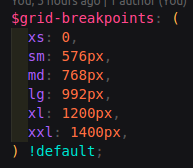

# RWD

### Web First or Mobile First

> 院內的系統開發通常為 web first，但 Frontend Template 目前並未撰寫關於 RWD 相關樣式。

根據現今行動裝置的普及，mobile first 崛起，另外也有許多 CSS Framework / Library 其實是以 mobile first 去撰寫，像是 Bootstrap、Tailwind、.etc

不過院內大多是開發 Web App，故這邊採用 web first 進行開發。


mobile first 跟 web first 差異在於：先寫目標需求的樣式，再補上不同解析度的樣式。


例如開發 web first 的應用程式，我的需求為 1920\*1080，我會先撰寫該解析度下的樣式，再考慮是否有不同解析度的需求往下撰寫。

反之，開發 mobile first 就是先寫低解析度的樣式，再往上寫高解析度的樣式。


### Breakpoints

> 每個系統的內容與排版皆有不同，Frontend Template 目前提供斷點管理與封裝好的 media query 讓使用者有較一致的方式可以撰寫 RWD。

RWD 即是在不同的解低度底下，顯示相對應的 UI，而其中，不同解析度的判斷，即是使用斷點來參考。

<figure><figcaption></figcaption></figure>

### Media Query

> 使用 Media Query 偵測畫面解析度

根據 Web First or Mobile First 會搭配不同的寫法：

例如開發 web first 的應用程式，會先寫目標解析度的樣式，再透過  `@media screen and (max-width: xxx)` 這種語法支援更小版面的樣式

<figure><figcaption></figcaption></figure>

反之，若是開發 mobile first 的應用程式，會先寫目標解析度的樣式，再透過  `@media screen and (min-width: xxx)` 這種語法支援更大版面的樣式


### Frontend Template 的 RWD

```scss
$grid-breakpoints: (
  xs: 0,
  sm: 576px,
  md: 768px,
  lg: 992px,
  xl: 1200px,
  xxl: 1400px,
) !default;

// Breakpoint viewport sizes and media queries.
//
// Breakpoints are defined as a map of (name: minimum width), order from small to large:
//
//    (xs: 0, sm: 576px, md: 768px, lg: 992px, xl: 1200px, xxl: 1400px)
//
// The map defined in the `$grid-breakpoints` global variable is used as the `$breakpoints` argument by default.

// Name of the next breakpoint, or null for the last breakpoint.
//
//    >> breakpoint-next(sm)
//    md
//    >> breakpoint-next(sm, (xs: 0, sm: 576px, md: 768px, lg: 992px, xl: 1200px, xxl: 1400px))
//    md
//    >> breakpoint-next(sm, $breakpoint-names: (xs sm md lg xl xxl))
//    md
@function breakpoint-next(
  $name,
  $breakpoints: $grid-breakpoints,
  $breakpoint-names: map-keys($breakpoints)
) {
  $n: index($breakpoint-names, $name);
  @if not $n {
    @error "breakpoint `#{$name}` not found in `#{$breakpoints}`";
  }
  @return if(
    $n < length($breakpoint-names),
    nth($breakpoint-names, $n + 1),
    null
  );
}

// Minimum breakpoint width. Null for the smallest (first) breakpoint.
//
//    >> breakpoint-min(sm, (xs: 0, sm: 576px, md: 768px, lg: 992px, xl: 1200px, xxl: 1400px))
//    576px
@function breakpoint-min($name, $breakpoints: $grid-breakpoints) {
  $min: map-get($breakpoints, $name);
  @return if($min != 0, $min, null);
}

// Maximum breakpoint width.
// The maximum value is reduced by 0.02px to work around the limitations of
// `min-` and `max-` prefixes and viewports with fractional widths.
// See https://www.w3.org/TR/mediaqueries-4/#mq-min-max
// Uses 0.02px rather than 0.01px to work around a current rounding bug in Safari.
// See https://bugs.webkit.org/show_bug.cgi?id=178261
//
//    >> breakpoint-max(md, (xs: 0, sm: 576px, md: 768px, lg: 992px, xl: 1200px, xxl: 1400px))
//    767.98px
@function breakpoint-max($name, $breakpoints: $grid-breakpoints) {
  $max: map-get($breakpoints, $name);
  @return if($max and $max > 0, $max - 0.02, null);
}

// Returns a blank string if smallest breakpoint, otherwise returns the name with a dash in front.
// Useful for making responsive utilities.
//
//    >> breakpoint-infix(xs, (xs: 0, sm: 576px, md: 768px, lg: 992px, xl: 1200px, xxl: 1400px))
//    ""  (Returns a blank string)
//    >> breakpoint-infix(sm, (xs: 0, sm: 576px, md: 768px, lg: 992px, xl: 1200px, xxl: 1400px))
//    "-sm"
@function breakpoint-infix($name, $breakpoints: $grid-breakpoints) {
  @return if(breakpoint-min($name, $breakpoints) == null, "", "-#{$name}");
}

// Media of at least the minimum breakpoint width. No query for the smallest breakpoint.
// Makes the @content apply to the given breakpoint and wider.
@mixin media-breakpoint-up($name, $breakpoints: $grid-breakpoints) {
  $min: breakpoint-min($name, $breakpoints);
  @if $min {
    @media (min-width: $min) {
      @content;
    }
  } @else {
    @content;
  }
}

// Media of at most the maximum breakpoint width. No query for the largest breakpoint.
// Makes the @content apply to the given breakpoint and narrower.
@mixin media-breakpoint-down($name, $breakpoints: $grid-breakpoints) {
  $max: breakpoint-max($name, $breakpoints);
  @if $max {
    @media (max-width: $max) {
      @content;
    }
  } @else {
    @content;
  }
}

// Media that spans multiple breakpoint widths.
// Makes the @content apply between the min and max breakpoints
@mixin media-breakpoint-between(
  $lower,
  $upper,
  $breakpoints: $grid-breakpoints
) {
  $min: breakpoint-min($lower, $breakpoints);
  $max: breakpoint-max($upper, $breakpoints);

  @if $min != null and $max != null {
    @media (min-width: $min) and (max-width: $max) {
      @content;
    }
  } @else if $max == null {
    @include media-breakpoint-up($lower, $breakpoints) {
      @content;
    }
  } @else if $min == null {
    @include media-breakpoint-down($upper, $breakpoints) {
      @content;
    }
  }
}

// Media between the breakpoint's minimum and maximum widths.
// No minimum for the smallest breakpoint, and no maximum for the largest one.
// Makes the @content apply only to the given breakpoint, not viewports any wider or narrower.
@mixin media-breakpoint-only($name, $breakpoints: $grid-breakpoints) {
  $min: breakpoint-min($name, $breakpoints);
  $next: breakpoint-next($name, $breakpoints);
  $max: breakpoint-max($next, $breakpoints);

  @if $min != null and $max != null {
    @media (min-width: $min) and (max-width: $max) {
      @content;
    }
  } @else if $max == null {
    @include media-breakpoint-up($name, $breakpoints) {
      @content;
    }
  } @else if $min == null {
    @include media-breakpoint-down($next, $breakpoints) {
      @content;
    }
  }
}

```

這裡拿了 Bootstrap 5 的程式來用，內容如下：

1. 定義不同斷點的解析度
2. 定義以下 mixin 讓開發者撰寫 RWD
   1. media-breakpoint-up
   2. media-breakpoint-down
   3. media-breakpoint-between
   4. media-breakpoint-only

使用情境如下：

> media-breakpoint-up

<div align="left">

<figure><figcaption></figcaption></figure>

</div>

> media-breakpoint-down

<div align="left">

<figure><figcaption></figcaption></figure>

</div>

> media-breakpoint-between

<div align="left">

<figure><figcaption></figcaption></figure>

</div>

> media-breakpoint-only

<div align="left">

<figure><figcaption></figcaption></figure>

</div>
